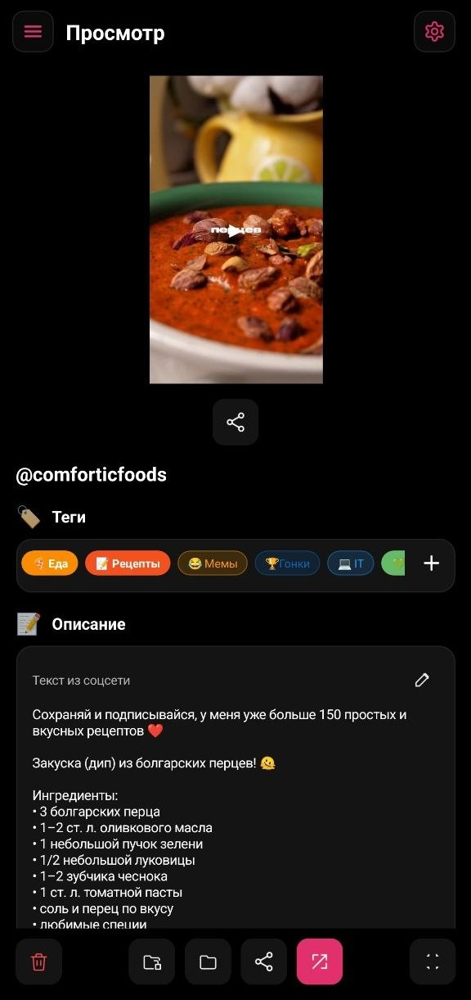
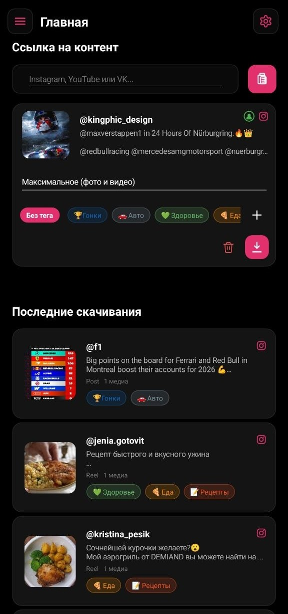
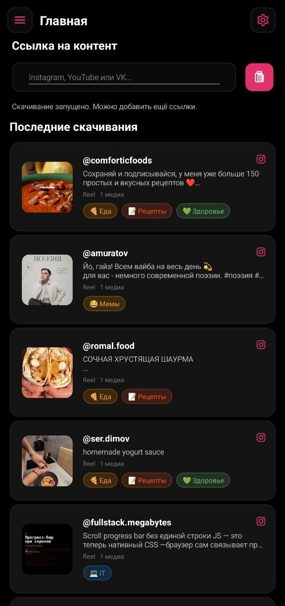
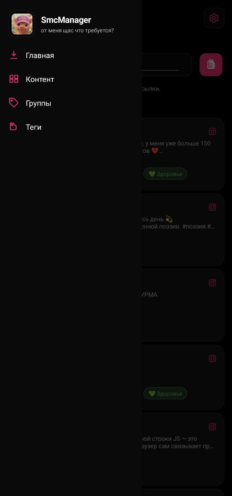
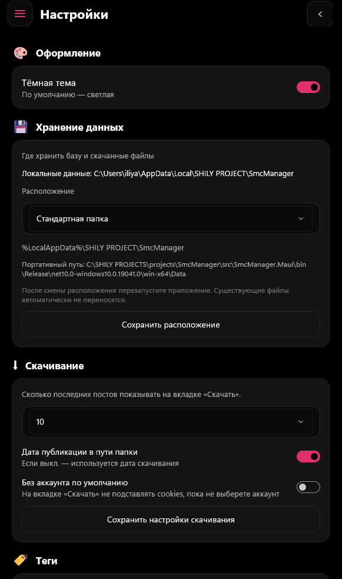

<div align="center">


# SmcManager

**от меня щас что требуется?**

*Скачивание и архив контента из соцсетей — в одном месте.*

[](https://dotnet.microsoft.com/apps/maui)
[](https://github.com)
[](src/SmcManager.Maui/SmcManager.Maui.csproj)

</div>

---

## О приложении

**SmcManager** (Social Media Content Manager) — кроссплатформенное приложение для скачивания, хранения и организации медиа из Instagram, YouTube и VK. Вставьте ссылку — получите превью, выберите качество и теги, сохраните в локальный архив. Всё остаётся на вашем устройстве.

При запуске вас встречает фирменная розовая свинья — потому что хранить контент должно быть не только удобно, но и немного весело.

<p align="center">
  
</p>

---

## Возможности

| Раздел | Что умеет |
|--------|-----------|
| **Главная** | Вставка ссылок, превью поста, выбор качества, теги, фоновое скачивание |
| **Контент** | Архив всех материалов с фильтрами: посты, Stories, Reels |
| **Группы** | Просмотр контента по тегам — быстрый доступ к нужной категории |
| **Теги** | Создание цветных тегов с эмодзи, поиск и сортировка |
| **Настройки** | Тема, хранилище, аккаунты соцсетей, прокси, параметры скачивания |

### Скачивание

- Поддержка **Instagram**, **YouTube** и **VK**
- Вставка ссылки одной кнопкой из буфера обмена
- Превью автора, описания и обложки до загрузки
- Выбор качества — от экономного до максимального
- Несколько ссылок в очереди: скачивание идёт в фоне, можно добавлять новые
- Публичный контент без cookies или приватный — через привязанный аккаунт

### Организация

- Цветные **теги** с эмодзи (Еда, Рецепты, IT, Здоровье и любые свои)
- Фильтрация в **Группах** по выбранному тегу
- Поиск по контенту и тегам
- Разделение по типу: посты, Stories, Reels

### Просмотр и экспорт

- Карусель фото и видео в полноэкранном режиме
- Текст описания из оригинального поста
- Редактирование тегов прямо в карточке
- Открытие папки в проводнике, шаринг медиа, переход к источнику

### Настройки

- Светлая и **тёмная тема**
- Стандартная или **portable** папка для базы и файлов
- Подключение аккаунтов Instagram / YouTube / VK (cookies, логин)
- HTTP-прокси для скачивания
- Лимит «последних скачиваний» на главной
- Дата публикации или дата скачивания в пути папки
- Режим «без аккаунта по умолчанию»

---

## Скриншоты

### Главная — скачивание по ссылке

<p align="center">
  
  &nbsp;&nbsp;
  
</p>

Вставьте ссылку → приложение подтянет метаданные → выберите качество и тег → нажмите скачать. История последних загрузок всегда под рукой.

### Навигация и разделы

<p align="center">
  
</p>

Боковое меню, архив контента с фильтрами, группы по тегам и управление тегами — всё в едином тёмном интерфейсе с розовыми акцентами.

### Настройки

<p align="center">
  
</p>

Оформление, расположение данных, параметры скачивания, теги, аккаунты и прокси — собраны в понятные секции.

---

## Технологии

| Слой | Стек |
|------|------|
| UI | .NET MAUI 10, CommunityToolkit.Maui, MVVM |
| Ядро | SmcManager.Core — модели, интерфейсы, бизнес-логика |
| Инфраструктура | yt-dlp, SQLite, HTTP-клиенты для Instagram API |
| Платформы | Windows 10+, Android 14+ |

---

## Структура проекта

```
SmcManager/
├── src/
│   ├── SmcManager.Core/           # Модели, интерфейсы, сервисы
│   ├── SmcManager.Infrastructure/ # Скачивание, БД, yt-dlp
│   └── SmcManager.Maui/           # UI, ViewModels, платформенный код
├── docs/
│   ├── pig-logo.png               # Логотип-свинья
│   └── screenshots/               # Скриншоты для README
├── publish.ps1                    # Сборка APK и EXE
└── SmcManager.slnx
```

---

## Сборка и запуск

### Требования

- [.NET 10 SDK](https://dotnet.microsoft.com/download)
- Для Android: Android SDK (API 34+)
- Для Windows: Windows 10 SDK (10.0.19041+)

### Разработка

```powershell
# Клонировать репозиторий
git clone <url> SmcManager
cd SmcManager

# Windows
dotnet build src/SmcManager.Maui/SmcManager.Maui.csproj -f net10.0-windows10.0.19041.0

# Android
dotnet build src/SmcManager.Maui/SmcManager.Maui.csproj -f net10.0-android
```

### Релизные артефакты

Из корня репозитория:

```powershell
.\publish.ps1
```

Скрипт соберёт `SmcManager_<version>.apk` и `SmcManager_<version>.exe` в  
`src/SmcManager.Maui/bin/Release/publish/`.

---

## Хранение данных

По умолчанию файлы и база лежат в:

```
%LOCALAPPDATA%\SHILY PROJECT\SmcManager\
```

В настройках можно переключиться на **portable**-режим — тогда данные хранятся рядом с исполняемым файлом (удобно для флешки или переноса между ПК).

---

<div align="center">

**SHILY PROJECT**

*SmcManager — от меня ща чё требуется?!*

</div>
